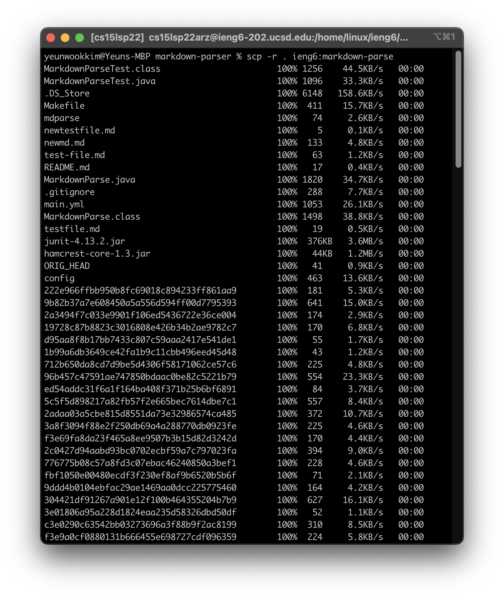

# CSE15L Week 6 Lab Report

## 1\. Streamlining ssh Configuration

`.ssh/config` file:

Logging into ieng6 with just the alias:

scp using alias:

## 2\. Setting up Githut Access from ieng6

Public key stored on Github:

Public and private key stored on ieng6 account:

Running git commands(commit and pushing) on ieng6 account:

[Link to commit on Github](https://github.com/Yanuk-K/markdown-parser/commit/59222e966ffbb950b8fc69018c894233ff861aa9)

## 3\. Copy Whole Directories with scp -r

Screenshot of copying the markdown-parse to ieng6 account:

Logging into ieng6 and compiling and running tests remotely:

Copying directory and running tests in one line(Used `/software/CSE/oracle-java-17/jdk-17.0.1/bin/javac` and `/software/CSE/oracle-java-17/jdk-17.0.1/bin/java` in place of `javac` and `java` per recommendation):

I used `scp -r *.java *.md lib/ ieng6:markdown-parse; ssh -t ieng6 "cd ./markdown-parse ; /software/CSE/oracle-java-17/jdk-17.0.1/bin/javac MarkdownParse.java; /software/CSE/oracle-java-17/jdk-17.0.1/bin/javac -cp .:lib/junit-4.13.2.jar:lib/hamcrest-core-1.3.jar MarkdownParseTest.java ; /software/CSE/oracle-java-17/jdk-17.0.1/bin/java -cp .:lib/junit-4.13.2.jar:lib/hamcrest-core-1.3.jar org.junit.runner.JUnitCore MarkdownParseTest"`
