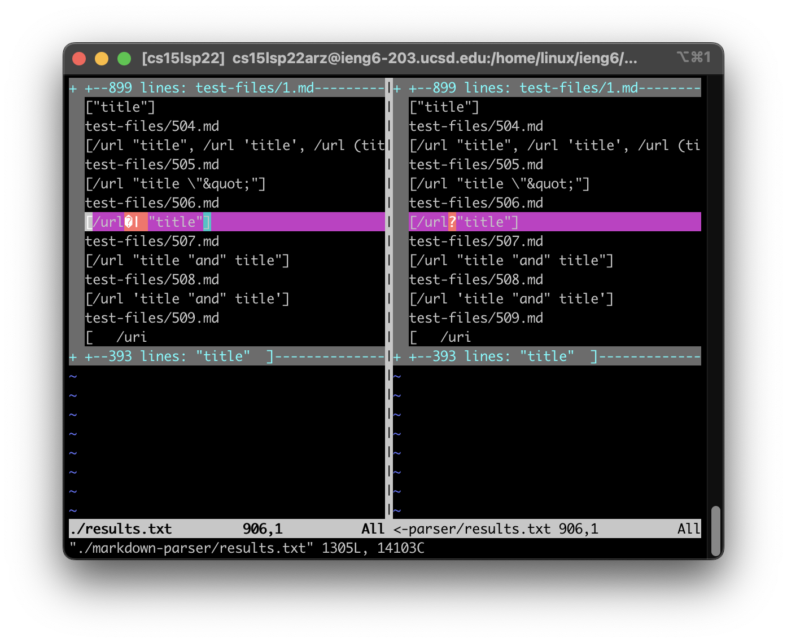

# CSE15L Week 10 Lab Report

Only test file 506.md had different results.

- How you found the tests with different results (Did you use vimdiff on the
results of running a bash for loop? Did you search through manually? Did you
use some other programmatic idea?)

I moved my results.txt from my local environment to the ieng6 server using scp, and used vimdiff to find the difference.

- Provide a link to the test-file with different-results (in the provided repository or
your repository , either is fine)

[Link to 506.md](https://github.com/nidhidhamnani/markdown-parser/blob/main/test-files/506.md)

For each test:

- Describe which implementation is correct, or neither if both give the
wrong output

Correct implementation according to commonmark is "/url".
Hence, both implementations are wrong.

- Indicate both actual outputs (provide screenshots) and also what the
expected output is (list the links that are expected in the output).

Left: My Implementation, Right: Implementation from Lab 9

Expected output is [/url]

- For the implementation that’s not correct (or choose one if both are
incorrect), describe the bug (the problem in the code) in about 2-3
sentences. You don’t have to provide a fix, but you should be specific
about what is wrong with the program, and show the code that should
be fixed (Provide a screenshot of code and highlight where the change
needs to be made).

The bug is that markdown treats enclosed text in quotation marks after the URL
as the title of the link, but neither code does not account for titles.

I think I could fix this by checking for any quotation marks inside parenthesis
when running the while loop checking for any links, and adjusting the closeParan variable.

