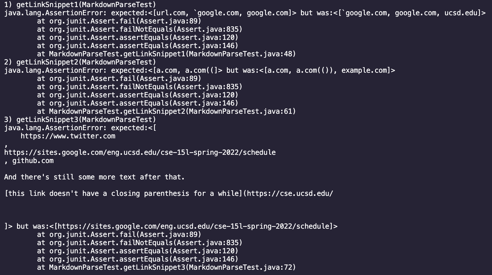
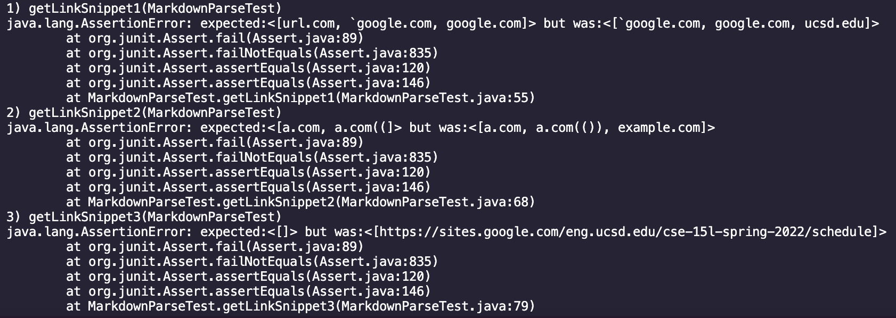
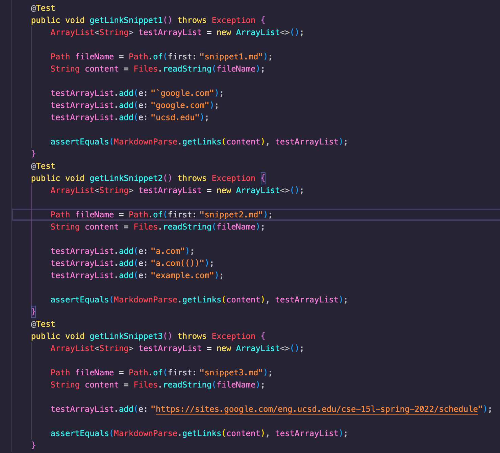

# CSE15L Week 6 Lab Report

[Link to my markdown-parse repository](https://github.com/Yanuk-K/markdown-parser)
[Link to the markdown-parse repository I reviewed](https://github.com/UDXS/markdown-parser)

### Expected Output for Snippet 1, according to [the CommonMark demo site](https://spec.commonmark.org/dingus/)
``[\`google.com, google.com, ucsd.edu]``

### Expected Output for Snippet 2, according to [the CommonMark demo site](https://spec.commonmark.org/dingus/)
`[a.com, a.com(()), example.com]`

### Expected Output for Snippet 3, according to [the CommonMark demo site](https://spec.commonmark.org/dingus/)
`[https://sites.google.com/eng.ucsd.edu/cse-15l-spring-2022/schedule]`

## Test results of my implementation of markdown-parse:

## Test result of markdown-parse from week 7:

## Test implementation(they are the same for both versions of markdown-parse):

## Questions:

### Do you think there is a small (<10 lines) code change that will make your program work for snippet 1 and all related cases that use inline code with backticks? If yes, describe the code change. If not, describe why it would be a more involved change.

- Yes. I could simply check for backticks(\`) that are outside parenthesis and/or brackets. If the backticks go over the open/close parenthesis and/or brackets, then continue to next open parenthesis.

### Do you think there is a small (<10 lines) code change that will make your program work for snippet 2 and all related cases that nest parentheses, brackets, and escaped brackets? If yes, describe the code change. If not, describe why it would be a more involved change.

- No, checking for nested links will require checking for any nested links inside links, and a correct implementation that covers all edge cases will be a long implementation with its own method.

### Do you think there is a small (<10 lines) code change that will make your program work for snippet 3 and all related cases that have newlines in brackets and parentheses? If yes, describe the code change. If not, describe why it would be a more involved change.

- No, checking for newline alone would take up at least 4 lines(simple method checking newline), and checking for edge cases will very easily make it go over 10 lines.
