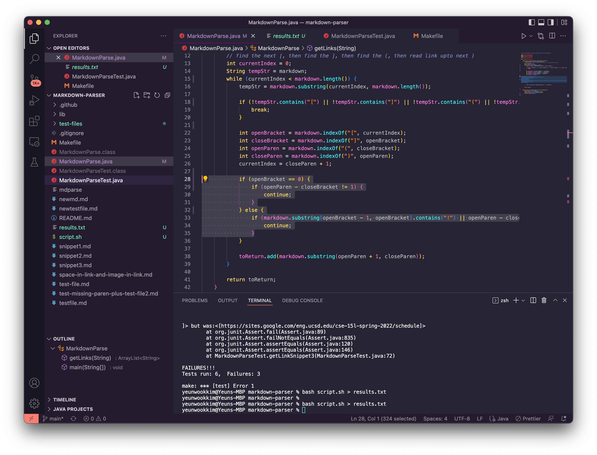

# CSE15L Week 10 Lab Report

Disclaimer: Only 506.md produced differing results compared to the lab code, so I edited my code to produce more errors.
I will refer to implementation by nidhidhamnani as "lab implementation."

- How you found the tests with different results (Did you use vimdiff on the
results of running a bash for loop? Did you search through manually? Did you
use some other programmatic idea?)

I moved my results.txt from my local environment to the ieng6 server using scp, and used vimdiff to find the difference.

- Provide a link to the test-file with different-results (in the provided repository or
your repository , either is fine)

[Link to 506.md](https://github.com/nidhidhamnani/markdown-parser/blob/main/test-files/506.md)
[Link to 519.md](https://github.com/nidhidhamnani/markdown-parser/blob/main/test-files/519.md)

For each test:

- Describe which implementation is correct, or neither if both give the
wrong output

506.md: Correct implementation according to commonmark is "/url".
Hence, both implementations are wrong.

519.md: Correct implementation according to commonmark is "".
Hence, the lab implementation is correct.

- Indicate both actual outputs (provide screenshots) and also what the
expected output is (list the links that are expected in the output).

506.md:

Left: My Implementation, Right: Implementation from Lab 9

Expected output is [/url]

519.md:

Left: My Implementation, Right: Implementation from Lab 9

Expected output is []

- For the implementation that’s not correct (or choose one if both are
incorrect), describe the bug (the problem in the code) in about 2-3
sentences. You don’t have to provide a fix, but you should be specific
about what is wrong with the program, and show the code that should
be fixed (Provide a screenshot of code and highlight where the change
needs to be made).

506.md: The bug is that markdown treats enclosed text in quotation marks after the URL
as the title of the link, but neither code does not account for titles.

I think I could fix this by checking for any quotation marks inside parenthesis
when running the while loop checking for any links, and adjusting the closeParan variable.

519.md: The bug is that I did not check for image tags.

I can fix this by checking for exclamation marks before the brackets.

