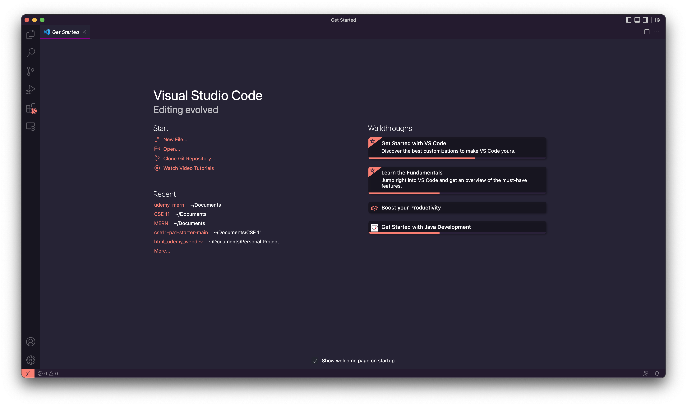
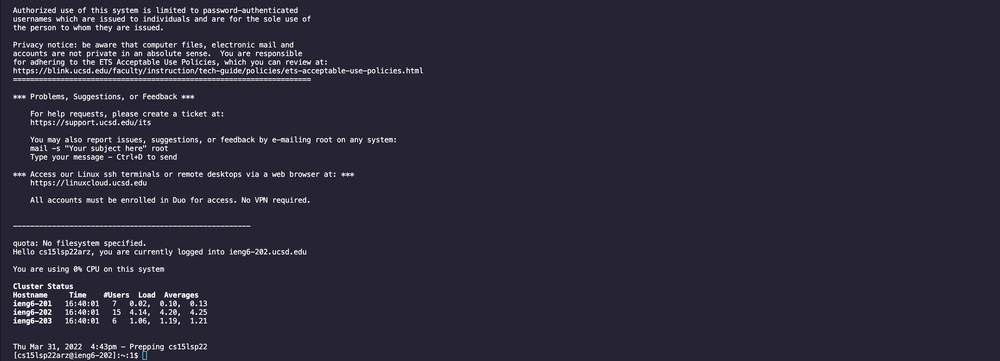
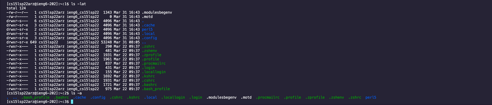
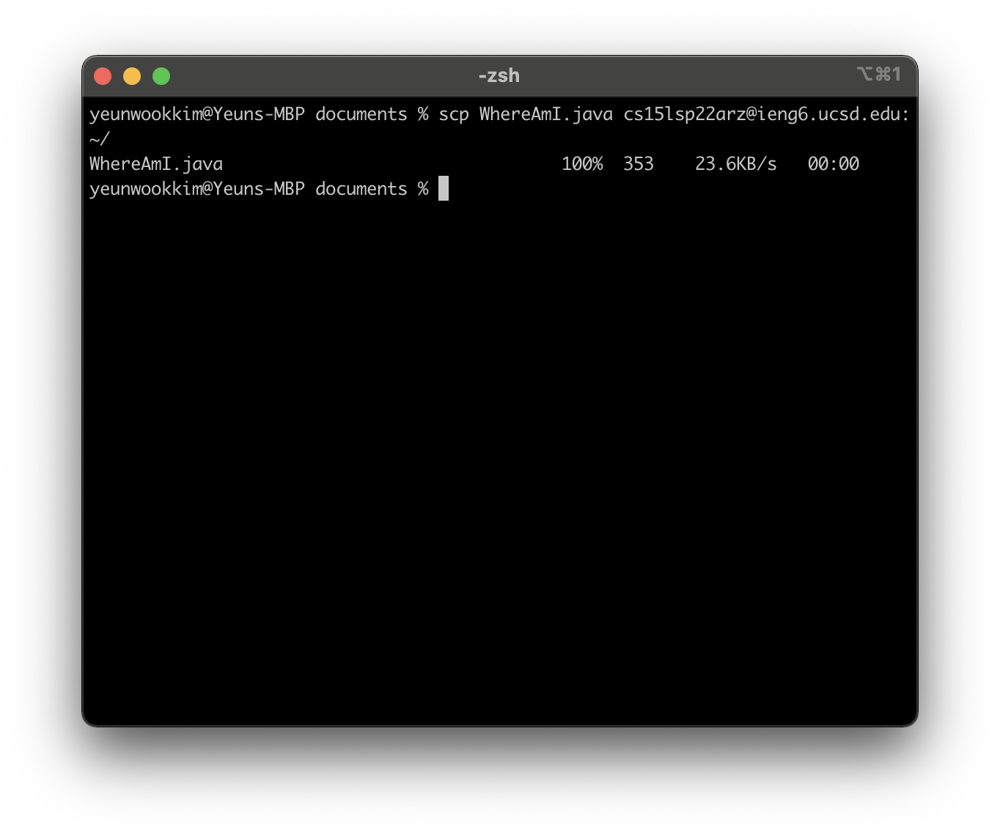
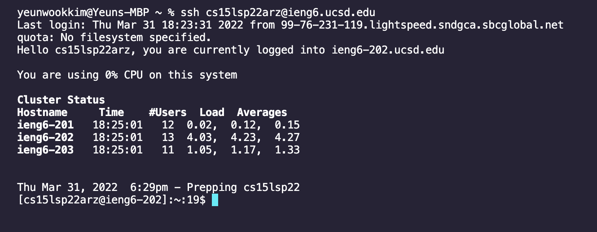
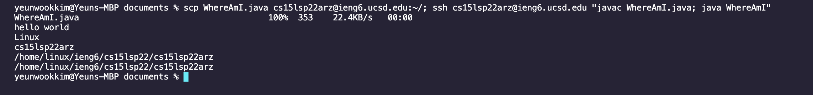

# CSE15L Week 2 Lab Report

1\. Installing VScode
  
Go to [https://code.visualstudio.com/](https://code.visualstudio.com/) and install Visual Studio Code for your operating system. After installing, VSCode will look something like this:



Your VSCode's theme and buttons may differ by your computer's operating system or environment.

2\. Remotely Connecting
  
>Extra steps for Windows users: [Install OpenSSH via this link](https://docs.microsoft.com/en-us/windows-server/administration/openssh/openssh_install_firstuse)

Open terminal on VSCode by clicking Terminal -> new Terminal from the menu, and remotely connect to your remote student server using the command `ssh cs15lsp22zz@ieng6.ucsd.edu`, where `zz` is replaced with your student account.

When connecting to the server for the first time, there may be a message like this:

```
$ ssh cs15lsp22zz@ieng6.ucsd.edu
The authenticity of host 'ieng6.ucsd.edu (128.54.70.227)' can't be established.
RSA key fingerprint is SHA256:ksruYwhnYH+sySHnHAtLUHngrPEyZTDl/1x99wUQcec.
Are you sure you want to continue connecting (yes/no/[fingerprint])?
```

Just type `yes` and press enter to these type of messages.

After that, you will be prompted to type your password. Enter your password and press enter.

A successful connection would look something like this:



3\. Trying Some Commands
  
Here is a list of commands to try out while connected to the server:
```
ls
cd
mkdir
cat
pwd
```

try them out and see what happens!

Here is a screenshot of ls-lat while connected on the server:



4\. Moving Files with scp
  
`scp "filename" cs15lsp22zz@ieng6.ucsd.edu:~/` move files to the server using this command.



5\. Setting an SSH Key
  
To make login easier, we can add a SSH Key.

On the client side, run `ssh-keygen` to create a key pair. **Make sure to not create a passphrase**

Now, SSH into your server again and `mkdir .ssh` to create a .ssh directory.

Logout after creating the .ssh directory, and move the public key(`id_rsa.pub` inside the `.ssh` directory) by using the command`scp /Users/"user"/.ssh/id_rsa.pub`

After setting up the SSH key, it will look something like this:



and now you don't need to enter your password to ssh or scp!

6\. Optimizing Remote Running
  
>Hint: We can use `;` between commands to make them run on a single line and `"command; command"` group commands together.



For example, I reduced `scp WhereAmI.java cs15lsp22zz@ieng6.ucsd.edu:~/`, `ssh cs15lsp22zz@ieng6.ucsd.edu:`, `javac WhereAmI.java`, and `java WhereAmI` to a single line of command `scp WhereAmI.java cs15lsp22zz@ieng6.ucsd.edu:~/; ssh cs15lsp22zz@ieng6.ucsd.edu "javac WhereAmI.java; java WhereAmI"` using this.

Considering I have the command pre-run beforehand, I can reduce the total keystroke to complete these actions into two keystrokes.
