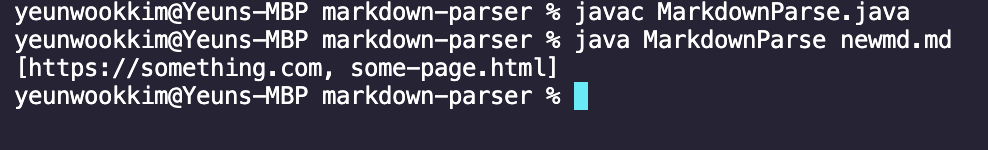

# CSE15L Week 4 Lab Report

## 1\. First Code Change

Screenshot of the code difference:

[Link to Test File](https://github.com/Yanuk-K/markdown-parser/blob/main/newmd.md)

Symptom of the failure-inducing input:

The bug was caused by the fact that `[link3](asdasd` did not have a closing parentheses, causing the loop to go out of bounds. Not having a closing parenthesis is also ilegal per markdown rules, so even if the code did not go out of bounds, it would've been a symptom regardless.

## 2\. Second Code Change

Screenshot of the code difference:

[Link to Test File](https://github.com/Yanuk-K/markdown-parser/blob/main/newmd.md)

Symptom of the failure-inducing input:

The bug was caused due to the fact that getLinks() only checks for the presence of . Having text in between the brackets and parentheses makes the link markdown ilegal, so the symptom is that it adds links to the Array when it shouldn't. The failure-inducing input is `[]asdasd()`.

## 3\. Third Code Change

Screenshot of the code difference:

[Link to Test File](https://github.com/Yanuk-K/markdown-parser/blob/main/newmd.md)

Symptom of the failure-inducing input:

The bug was caused by incorrectly checking for images, as I mistook the format to include images to be `[!]()`, whereas the format for image in markdown is ``. The failure-inducing input is ``, and before the edit, it included `some-page.html` in the Array due to my mistake in checking for images.
